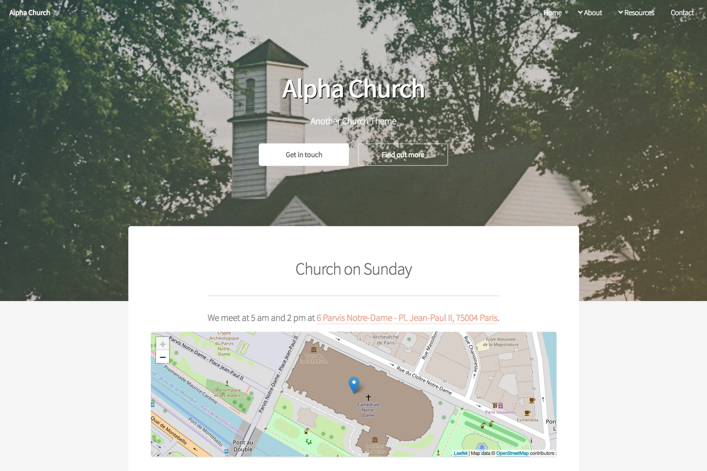

# Alpha-Church by Daniel Saunders

This theme is based on [Alpha by HTML5 UP](http://html5up.net/alpha) [@ajlkn](http://twitter.com/ajlkn). Free for personal and commercial use under the CCA 3.0 license (html5up.net/license)

A clean, super minimal responsive template geared towards churches though it could be adapted for other community groups. This theme includes a landing page, open street maps, blog posts and a sermon podcast.



Demo images courtesy of [freelyphotos](https://freelyphotos.com), totally free high-quality stock photography available under the fantastic [CC0 (public domain)](http://creativecommons.org/publicdomain/zero/1.0/) license.

Feedback, bug reports, and comments are not only welcome but  encouraged :)

## Get the theme

If you have `git` installed, you can do the following at the command-line-interface within the Hugo directory:

```
$ mkdir themes
$ cd themes
$ git submodule add https://github.com/funkydan2/alpha-church.git
```

You should see a folder called `alpha-church` inside the `themes` directory that we created a few moments ago. For more information read the official [setup guide](https://gohugo.io/overview/installing/) of Hugo.

## Setup

In the next step navigate to the `exampleSite` folder at `themes/hugo-travelify-theme/exampleSite/` and copy `config.toml` from the exampleSite folder into the root folder of your Hugo site. (Please refer to http://gohugo.io/overview/quickstart/ for installing a Hugo theme.)

## The `config` file

Now, let us take a look at `config.toml`. Let's take a look at some of the settings.

### 1. Custom CSS
The easiest way to change the look of your site is by overriding the included style sheet. You can do this by putting your css file in `static/css/my.css` and entering `customCSS = ["my.css"]` in the config file.

### 2. Google Analytics
Enable by putting your Analytics key here.
```
GoogleAnalytics = ""
```

### 3. Menu & Nested Menus

The entries in the items menu can be customised. The structure of the menu is defined in `config.toml`.

```
[menu]
  [[menu.main]]
    name = "Home"
    url = "/"
    weight = 1
```

Define a label and enter the URL of the resource you want to link. The `weight` value determines the order of menu items. Lower weighted entries appear to the *left* of higher weighted entries.

For sub-menus, you can use the following format:

```
[[menu.main]]
  name = "About"
  url = "/about"
  weight = 2

[[menu.main]]
  name = "About Us"
  parent = "About"
  url = "/about"
  weight = 1
```
In this example, *About* is in the main menu, but *About Us* is in the *About* sub-menu. In *Alpha Church* the sub-menu is a drop-down menu.

### 4. Podcasting
In `config.toml` there are settings which are used to generate the podcast RSS feed.

```
[params.podcast]
  title = "Listen to Alpha Church"
  subtitle = ""
  summary = "Alpha-Church sermons, talks, messages—podcasted."
  email = "test@example.com"
  image = "Link to 1400*1400 (or larger) file"
  category = "Religion & Spirituality"
  sub_category = "Christianity"
```
All of these need to be set (except subtitle) or else the feed will not be valid.

Some of these entries look like site-wide settings (e.g. `title`). They need to be set here as you may which to use a title for your site which is different from your podcast.

As you're developing your site, you'll need to check the podcast feed is valid by entering the feed's URL into [a podcast feed validator](https://castfeedvalidator.com).

The podcast feed is found at `/sermons/index.xml`.

### 5. Landing (Home) page
The landing page is quite customisable. It consists of five blocks: a banner, an area for information about services (including a map), featured icons, featured images, and a contact form.

#### a. Banner
The banner section requires a background image to be set. This image should be 1800*1200 px, and a relatively simple image will probably look best.

You can place link buttons in this area by using the following settings.

```
[[params.landing.banner.button]]
  url = "/contact"
  text = "Get in touch"
  type = "special"
```

#### b. Service information
Below the banner is an area which could be used for highlight service location and times. The settings for the [open street map](https://openstreetmap.org) in this area are detailed below.

#### c. Feature Icons
These feature icons are pulled from [fontawesome](https://fontawesome.com). The layout requires an even number of these blocks (well, you could have an odd number, but it would look, well, odd). To find items [search around on the fontawesome site](https://fontawesome.com/icons?d=gallery)

```
[[params.landing.feature_icons.tile]]
  icon = "fa-users"
  icon_pack = "fas"
  accent = "2"
  title = "Meet"
  text = "Meeting together to hear."
```
The value of the `icon` and `icon_pack` setting is found on the FontAwesome site. `Accent` is a colour scheme set in the css (there are 5 accent colours).

#### d. Feature Images
Like the *Feature Icons* this section looks best with an even number of entries.

### 6. Map
This theme makes use of [open street maps](https://openstreetmap.org) on the landing page and as a shortcode.

To set your organisations' location edit `config.toml`.
```
[params.map]
  latitude = "48.8530"
  longitude = "2.3498"
  zoom = "18"
```
To find the appropriate values, visit https://openstreetmap.org and find the location you want to be shown on your map. Then look at the URL in your browser's location bar. You'll see something like `https://www.openstreetmap.org/search?query=New%20York#map=14/40.6971/-73.9796`. The final three numbers in this URL give the values of Zoom/Latitude/Longitude.

If you'd like a map on another page, you can use the shortcode ``

### 7. Contact Form
You can have a contact form using either a [netlify form](https://www.netlify.com/docs/form-handling/) (if you're deploying with netlify) or [formspree](https://formspree.io)
```
[params.contact]
  service = ""
  confirm_page = "/contact_thanks"
  formspree_email=""
```
With these setting, set *service* to either `service = "netlify"` or `service = "formspree"`.

If you're using formspree, you'll also need to set `formspree_email` to your email address.

If you're using netlify, you'll also want to set the `confirm_page = "url"` to a page on your site. That way after a user submits the form they'll be sent to a page with your customised thank you message, rather than a generic netlify page.

If you'd like a contact form on another page, use the shortcode ``
### 8. Links
At the very bottom of each page is a bunch of icons (from FontAwesome) which can be used for links to social media, RSS feeds, or whatever you like!
```
[[params.links]]
  service = "Facebook"
  icon = "fa-facebook"
  icon_pack = "fab"
  link = "//facebook.com/"

[[params.links]]
  service = "Podcast"
  icon = "fa-podcast"
  icon_pack = "fas"
  link = "/sermons/index.xml"

[[params.links]]
  service = "Full RSS Feed"
  icon = "fa-rss"
  icon_pack = "fas"
  link = "/index.xml"
```

## Nearly finished

To preview your site, run Hugo's built-in local server.

```
$ hugo server -D
```

Now enter [`localhost:1313`](http://localhost:1313) in the address bar of your browser.

## Credits:
- Design based on [Alpha by HTML5 UP](http://html5up.net/alpha) [@ajlkn](http://twitter.com/ajlkn)

### Demo Images:

- [FreelyPhotos](https://freelyphotos.com):
  - [Banner Image (Church Building)](https://freelyphotos.com/church-building-2/)
  - [Old Bible](https://freelyphotos.com/old-bible-3/)
  - [Running Child](https://freelyphotos.com/running/)
  - [Group of People](https://freelyphotos.com/group-of-people/)
  - [Microphone (podcast cover)](https://freelyphotos.com/microphone/)

### Icons:

* [Font Awesome](http://fortawesome.github.com/Font-Awesome)

### Other:

* [jQuery](http://jquery.com)
* [html5shiv.js](https://github.com/aFarkas/html5shiv) (@afarkas @jdalton @jon_neal @rem)
* [CSS3 Pie](http://css3pie.com)
* [background-size polyfill](http://github.com/louisremi)
* [Respond.js](http://j.mp/respondjs)
* [Skel](http://skel.io)
